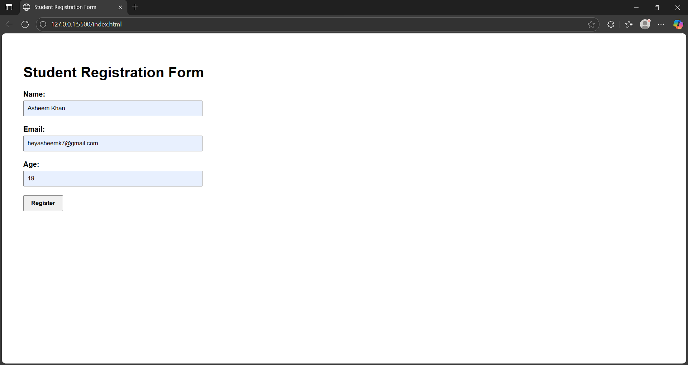

# 📝 Student Registration Form

This project is a **basic HTML Student Registration Form** with user-friendly design and HTML5 validation.

---

## 🔧 Features

- 📄 Simple and responsive HTML form
- ✅ Uses HTML5 validation (e.g., required fields, email format, number range)
- 🎨 Easy to customize and style with CSS
- 🧠 Great for learning form handling basics

---

## 💡 Technologies Used

- HTML5
- CSS3 (for styling)
- (Optional: Live Server extension for preview)

---

## 📁 Folder Structure

```
student-form/
├── index.html
├── style.css
└── images/
    └── Student Form.png
```

---

## 🖼️ Screenshot


---

MADE BY RAGHAV RAINA 23BCS10741

Built by Asheem Khan (23BCS13395)  

---

© 2025 Student Form Project
